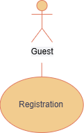
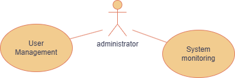
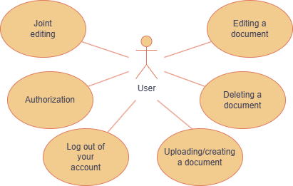
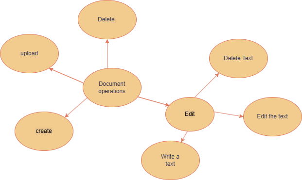

# CBox-BE
CBox is a fast, convenient cloud storage with open Source code.
Our main goal is to provide users with privacy, you can mark your data as "private" and no one will access it.

Project is using next technologies:
* Spring Boot 3
* Java 21
* PostgreSQL
* Redis

# Use-Case Diagrams: 
 * Guest Scenario
   
 * Admin Scenario
   
 * User Scenario
   
 * Document Scenario
   

# DB ERD

